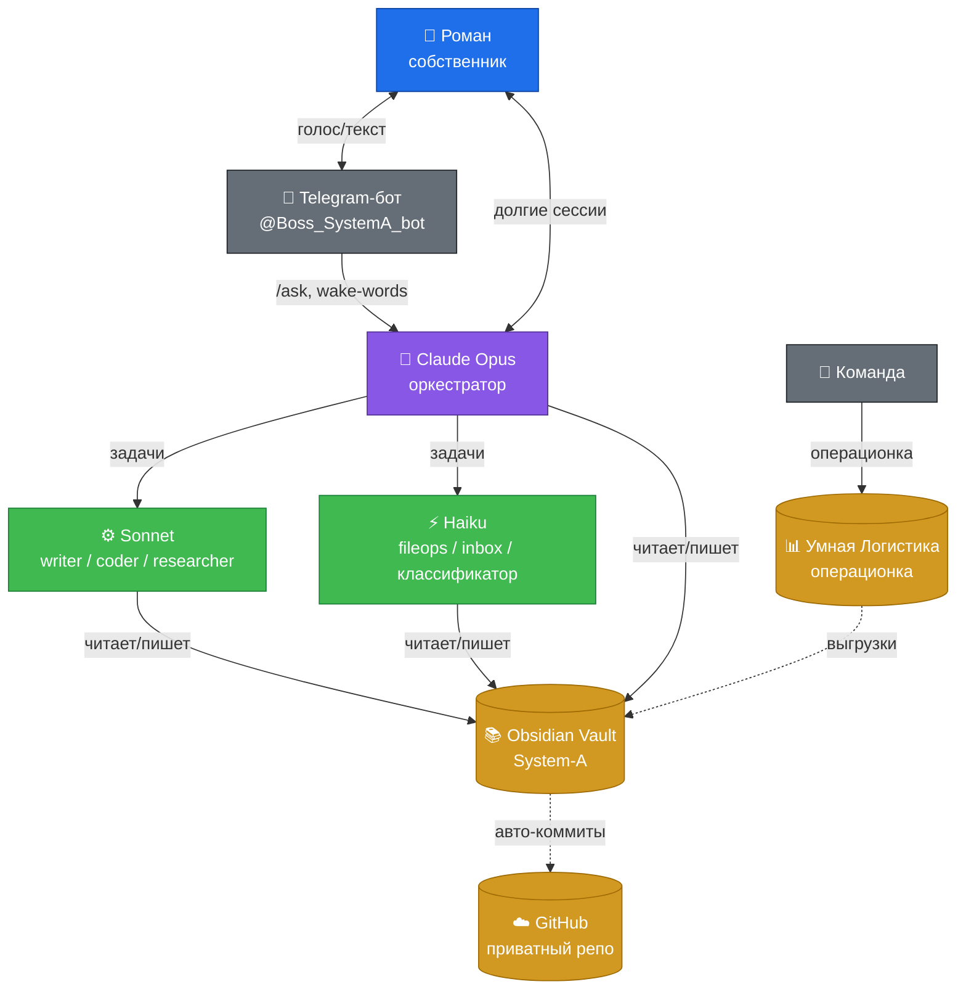

---
aliases:
  - Карта системы
  - Главная
  - Оркестратор
tags:
  - зона/система
  - тип/карта
---

# Карта системы

> Центральный узел. Отсюда видно всё: оркестратор, зоны ответственности, активные проекты, дедлайны.
>
> **Как читать:** Mermaid-диаграмма ниже — это архитектура. Дальше — карта зон с прямыми ссылками на конкретные документы. Открывай через [[Карта системы]] в графе или прыгай по ссылкам.

## Оркестратор и команда (схема)

Подробности — [[Multi_Agent_Architecture|Архитектура мульти-агентов]].

## Зоны ответственности

### 🚛 Операции (Модель A — свой парк, Модель B — Москва)

- [[Pinned Facts|Зафиксированные факты]] — что Claude помнит каждую сессию
- [[Models_Map|Карта моделей бизнеса]]
- [[Dispatcher_Welcome_Doc|Welcome для Татьяны]]
- [[Dispatcher_Job_Description|Должностная инструкция диспетчера]]
- [[Dispatcher_Bonus_Scheme|Премиальная схема диспетчера]]
- [[Dispatcher_Escalation_Map|Карта эскалаций]]
- [[Dispatcher_Onboarding|Онбординг диспетчера]]
- [[First_Meeting_With_Tatyana|Первая встреча с Татьяной]]
- [[Carrier_Audit_Checklist|Чеклист аудита контрагентов]]
- [[Team_Cadence|Ритм работы команды]]
- [[Interview_2026-04-22|Интервью 22.04 — операции]]

### 👥 Люди и управление

- [[Rop_Management|Управление РОПом]]

### 🛠 Билдер (автоматизация)

- [[Tender_Parser|Парсер тендеров — ТЗ]]
- [[Carrier_Lookup_Service|Carrier Lookup — автопроверка по ИНН]]
- [[Telegram_Voice_Bot|Telegram-бот @Boss_SystemA_bot]]
- [[VPS_Analysis|Выбор VPS для бота и парсера]]

### 🎨 Бренд

- [[Brand_Project|Брендинг — Тихоокеанская звезда]]
- [[Cases_Pending|Кейсы в работе]]

### 📋 Дашборд и ритм

- [[Weekly_Review|Еженедельный обзор]]
- [[Daily_Note_Template|Шаблон ежедневной заметки]]

### 🧠 Система (мета-слой)

- [[Multi_Agent_Architecture|Архитектура мульти-агентов v2]] — Gemini как дефолтный воркер
- [[Gemini_CLI_Setup|Gemini CLI — установка и операционка]]
- [[2026-05-08-Gemini_as_default_worker|Решение: Gemini как дефолт (08.05.26)]]
- [[Assistant_Brief|Бриф для AI-ассистента]]
- [[Discovery_Roadmap|Roadmap интервью с собой]]
- [[Mobile_Capture_Plan|План мобильного капчура]]
- [[Setup_Guide_GitHub|Setup Guide — GitHub]]

## Активные дедлайны

- 🔴 **30 апреля / 1 мая 2026** — выход [[Dispatcher_Welcome_Doc|Татьяны]] на смену.
- 🟢 **9 марта 2026** — заявка в [[Carrier_Audit_Checklist#B7|реестр ГосЛог]] подана. Ждём уведомления.
- 🟡 **1 марта 2027** — обязательная регистрация перевозчиков в реестре ГосЛог.

## Активные проекты в работе

| Проект | Статус | Документ |
|---|---|---|
| Онбординг Татьяны | PDF собран, встреча 30.04 | [[Dispatcher_Welcome_Doc]] |
| Парсер тендеров MVP | селекторы проверены, нужен Playwright на VPS | [[Tender_Parser]] |
| ГосЛог-реестр | ждём государство | [[Pinned Facts]] |
| Бренд / Тихоокеанская звезда | пока на паузе | [[Brand_Project]] |
| Carrier Lookup Service | ТЗ есть, после парсера | [[Carrier_Lookup_Service]] |

## Правила навигации в графе Obsidian

1. Включи в настройках графа **показ Aliases** — будут русские имена.
2. В **Filters** поставь "Existing files only" — пропадут серые точки несуществующих ссылок.
3. В **Groups** добавь цветовые группы по тегам:
   - `tag:#зона/операции` — синий
   - `tag:#зона/билдер` — зелёный
   - `tag:#зона/бренд` — оранжевый
   - `tag:#зона/система` — фиолетовый
   - `tag:#зона/команда` — жёлтый
4. В **Display** включи "Show arrows" — увидишь направление связей.

## Что добавлять в эту карту

При появлении нового крупного документа — добавляй сюда ссылку в нужную зону. Если зона не подходит — заводим новую. Карта должна оставаться **обзорной**, не превращаться в свалку: ссылки только на узловые документы, не на каждый чих.

---

**См. также:** [[_VAULT_README|README хранилища]] | [[Pinned Facts|Что Claude помнит]] | [[Multi_Agent_Architecture|Как работает оркестратор]]
