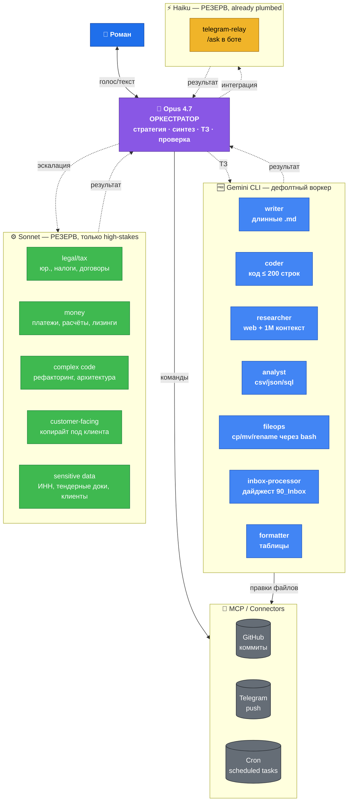

---
aliases:
  - Архитектура мульти-агентов
  - Оркестратор
tags:
  - зона/система
  - тип/архитектура
---

# Multi-Agent Architecture v2 — Gemini как дефолтный воркер

> Создано 28.04.26 (v1: переход от «Opus делает всё» к Opus + Sonnet/Haiku sub-agents).
> Обновлено 08.05.26 (v2: Gemini CLI становится дефолтным воркером, Sonnet/Haiku уходят в резерв).
>
> **Цель v2**: дальше снизить расход токенов — пока работаем над «обычными» задачами, основной воркер бесплатный (Gemini CLI), Sonnet/Haiku вызываем только когда задача требует.

## Изменение между v1 и v2

В v1 правильным было «Opus делегирует Sonnet/Haiku вместо того, чтобы делать всё сам». Это работало, но всё равно платная история — даже Haiku по $0.05/день.

В v2 — инверсия: **Gemini CLI = дефолт**, Sonnet/Haiku = резерв на high-stakes. Расходы Anthropic-яруса падают почти до нуля по будням, поднимаются только когда задача того стоит.

## Целевая архитектура v2



## Распределение моделей по типам работы (v2)

| Тип работы | Модель | Примечание |
|---|---|---|
| Разговор с Романом, стратегия, синтез, проверка | **Opus (я)** | без изменений |
| Длинная техническая запись (5K+ токенов вывода) | **Gemini CLI** | через `gemini -p`, проверяю diff |
| Поиск фактов в интернете (свежие, нужен web) | **Opus + WebSearch/WebFetch** | в нашей сети встроенный Google Search внутри gemini-cli заблокирован (10.05.26); research-через-web делает Opus, Gemini получает уже сырые факты на оформление |
| Reasoning / факты из базы знаний (без web) | **Gemini CLI** | стабильные знания, существующие годами процессы — Gemini тянет |
| Код ≤ 200 строк, простой | **Gemini CLI** | проверяю diff, при запахе → Sonnet |
| Парсинг чужого текста (inbox, voice transcripts) | **Gemini CLI** | дайджест 90_Inbox |
| Копирование/перемещение/правки файлов | **Gemini CLI** или прямой bash | смотри что проще |
| Форматирование таблиц | **Gemini CLI** | дешевле некуда |
| Анализ CSV/JSON | **Gemini CLI** | его 1M-контекст это любит |
| Юридическое/налоги/договоры | Sonnet | high-stakes |
| Расчёты по деньгам, платежам, лизингам | Sonnet | high-stakes |
| Сложный код / рефакторинг / архитектура | Sonnet | где Gemini может незаметно сломать |
| Customer-facing копирайт (письма клиентам, сайт) | Sonnet | репутационная ставка |
| Задачи с чувствительными данными (ИНН, тендерные доки, клиенты) | Sonnet | приватность free-tier Gemini |
| Простые вопросы в Telegram-боте `/ask` | Haiku | уже стоит, не трогаем |
| Сложные вопросы в боте с контекстом | переключим на Gemini позже | план: переписать `/ask` слой на Gemini |

## Правила маршрутизации (для меня самого, v2)

1. **<2 минуты работы** — делаю сам. Делегирование стоит токенов на установку контекста.
2. **Дефолт для всего остального — Gemini CLI**. Я (Opus) даю самодостаточный промпт, Gemini выполняет, я проверяю diff.
3. **Эскалация на Sonnet** — если хотя бы одно из:
   - high-stakes (юр./налоги/деньги/customer-facing/репутация)
   - чувствительные данные (ИНН контрагентов, тендерные доки, клиентские реквизиты)
   - сложный код / рефакторинг / архитектура
   - Gemini не справился с третьего захода
4. **Haiku** — только там, где интеграция уже работает (telegram-relay `/ask`). Новых случаев не плодим.
5. **Параллельные задачи без зависимостей** — пускаю несколько Gemini-вызовов одновременно через `&` в bash.
6. **Высокая ставка** — двойная проверка: Gemini делает → Sonnet проверяет → Opus финальный арбитраж.

### Пре-флайт чеклист (перед делегированием Gemini)

- [ ] Самодостаточный промпт: цель, контекст, что уже сделано, что НЕ делать, формат ответа.
- [ ] Указан лимит длины ответа («под 200 слов», «список путей»).
- [ ] Указан вид вывода (Markdown / JSON / plain).
- [ ] Чувствительные данные? Если да — это уже Sonnet, не Gemini.
- [ ] Если несколько независимых проверок — запускаю в одном сообщении параллельно.

### Антипаттерны (за это ругать себя)

- 🚫 Сам пишу длинный .md под диктовку → должен был отдать Gemini.
- 🚫 Отдал Sonnet'у задачу, которую тянет Gemini → потратил $$$ зря.
- 🚫 Запускаю Gemini-вызовы последовательно, когда они независимы → должен был параллелить.
- 🚫 Засунул в Gemini ИНН контрагента → нарушил политику приватности.

## Когда вернуться к Sonnet/Haiku по умолчанию (триггеры отката)

v2 — это сознательный компромисс «дёшево сейчас, чуть больше ручной верификации». Откат к v1 (Sonnet как дефолт) триггерится, если:

- Gemini регулярно (>30% случаев) ошибается, и проверка/повторы стоят дороже, чем Sonnet с первого раза.
- Упёрлись в дневной лимит (1000 запросов) и это блокирует работу.
- Объём чувствительных задач вырос так, что Sonnet всё равно зовётся в большинстве случаев — тогда выгоднее не переключаться туда-сюда.
- Появится Sonnet/Haiku сопоставимый по бесплатности (через бесплатный API-кредит, через корпоративный тариф и т.п.).

Метрика для оценки: считаем долю «Gemini справился с первого раза» в логах `99_System/logs/`. Цель — > 70%.

## Что подключено и что нужно подключить

### Уже есть

- Opus в режиме оркестратора (Cowork mode + Claude Code).
- Telegram-бот `@Boss_SystemA_bot` на Haiku 4.5 (для `/ask`).
- GitHub-репо vault'а, авто-коммиты через бот.

### Подключаем сейчас (v2)

| Компонент | Зачем | Статус |
|---|---|---|
| **Gemini CLI** (npm `@google/gemini-cli`) | дефолтный воркер | 🔴 Срочно — установка по `Gemini_CLI_Setup.md` |
| **MCP gemini-mcp-tool** | чистый вызов Gemini как tool из Claude Code | 🟡 После того, как Gemini CLI заработает напрямую |
| **`99_System/logs/`** | логи каждого вызова Gemini для анализа качества | 🔴 Создаётся вместе с переходом |

### Подключим по ходу

| Компонент | Зачем | Приоритет |
|---|---|---|
| GitHub MCP | sub-agents коммитят сами, без `cp/git push` руками | 🟡 |
| Telegram MCP | пуш Роману «задача готова, проверь» | 🟡 после MVP парсера |
| Cron / scheduled tasks | ежедневный inbox-digest в 21:00 (Gemini) | 🟡 |

## Skills (повторяемые паттерны под Gemini)

Skills остаются прежней идеей — пресеты, которые я применяю без переобъяснения. Под v2 переписываем их так, чтобы вызов шёл в Gemini, а проверка у меня.

| Skill | Что делает | Кто исполняет |
|---|---|---|
| `gemini-research` | по теме → 5–7 фактов + источники + 3 follow-up-вопроса | Gemini |
| `gemini-writer` | по брифу + заметкам → чистый Markdown-документ | Gemini |
| `gemini-critic` | по документу → список ошибок и слабых мест | Gemini |
| `inbox-digest` | за период → дайджест по темам, action items | Gemini |
| `pinned-facts-update` | обновить `Pinned Facts.md` без потери стиля | Gemini → Opus финальная проверка |
| `carrier-card-create` | по ИНН → карточка контрагента в УЛ-формате | Sonnet (чувствительные данные) |
| `tender-classify` | по описанию лота → «релевантно/нет» + причина | Gemini → если рисково, Sonnet |
| `case-card-create` | из фото + описания → карточка для `04_Brand/Cases_Pending.md` | Gemini |
| `designer` | визуал (лого/баннер/пост/подпись/кейс) → концепт + план под бесплатный инструмент + копирайт | Sonnet (Cowork) / Gemini-2.5-pro (локально). Не путать с `design-brief` (бриф для фрилансера). High-stakes макеты (Роспатент, юр.) — Sonnet напрямую, минуя skill. Логи в `99_System/logs/<TS>-designer-<slug>.md`. Подробности — [[skills/designer/SKILL]], решение — [[2026-05-12-Designer_agent_role]]. |

> Создавать через `skill-creator`. Каждый skill — отдельный markdown в `99_System/skills/` с указанием исполнителя по умолчанию.

## Экономика v2

| Сценарий | Стоимость/день |
|---|---|
| v0 (всё на Opus) | ~$5–7 |
| v1 (Opus + Sonnet/Haiku sub-agents) | ~$1.5–2 |
| **v2 (Opus + Gemini-default + Sonnet/Haiku-резерв)** | **~$0.5–1** |

Расклад v2:
- Opus (я, оркестрация и проверка) — ~$0.5–1/день.
- Gemini (основной воркер) — **$0** на free tier.
- Sonnet (резерв на high-stakes) — обычно $0–0.3/день, скачки до $1+ в сложные дни.
- Haiku (telegram-relay) — ~$0.05/день, не трогаем.

**Экономия по сравнению с v1: ещё 50–70%.** Главное — не плодить лишние вызовы Sonnet там, где справится Gemini.

## Метрики и пересмотр

- Раз в неделю смотрю распределение в `99_System/logs/`: какой % задач реально ушёл на Gemini, сколько раз эскалировал на Sonnet, сколько было повторов.
- Если доля «Gemini с первого раза» < 70% — разбираю, на чём он валит, корректирую промпты или переношу класс задач в Sonnet.
- Раз в месяц — ревизия skills и MCP: что добавить, что удалить, что переключить между Gemini и Sonnet.

## TODO (после перехода на v2)

- ☐ **Я (Opus)**: установить Gemini CLI по `Gemini_CLI_Setup.md`, прогнать тестовый запрос.
- ☐ **Я (Opus)**: создать первый skill `gemini-research` в `99_System/skills/`.
- ☐ **Я (Opus)**: при следующих 5 задачах сразу решать — Gemini, Sonnet или сам. Логировать в `99_System/Delegation_Log.md` с пометкой какого ярусa.
- ☐ **Я (Opus)**: после первых 20 вызовов Gemini — короткий self-review, какая доля «с первого раза».
- ☐ **Роман**: одобрить план или скорректировать.

## Практическая команда вызова (запомнить)

Всегда (без исключений в нашей сети):

```bash
gemini -m gemini-2.5-flash -p "..."   # для рутины
gemini -m gemini-2.5-pro   -p "..."   # для сложного research / writing / кода
```

Обязательное окружение (в `~/.zshrc`):

```bash
export GEMINI_API_KEY="..."
export NODE_OPTIONS=--dns-result-order=ipv4first
```

Без `-m` и без `NODE_OPTIONS` — стабильный `fetch failed`. Подробности — [[Gemini_CLI_Setup]].

## Уточнённые триггеры отката (после E2E 10.05.26)

К ранее зафиксированным условиям добавляется один практический:

- **Если ретраи стабильно падают все три попытки и запрос не проходит** — сетевой канал у российского ISP / у Google окончательно закрылся. Тогда переключаемся на DeepSeek API (план Б, описан в `30_Decisions/2026-05-08-Gemini_as_default_worker.md` как опция).

Пока (10.05.26) канал работает с retry-задержкой 2–10 секунд — едем.

## История

- 28.04.26 — создан Claude (Opus) по запросу Романа из Telegram 03:39 (v1: переход на Sonnet/Haiku sub-agents).
- 08.05.26 — переработан в v2 (Gemini CLI как дефолтный воркер). Решение зафиксировано: `30_Decisions/2026-05-08-Gemini_as_default_worker.md`. Операционный гайд: `Gemini_CLI_Setup.md`.
- 10.05.26 — Gemini CLI установлен и проверен E2E. Зафиксированы обязательные настройки: API-ключ через AI Studio, `NODE_OPTIONS=--dns-result-order=ipv4first`, явный `-m gemini-2.5-flash`. Канал нестабильный (1–3 ретрая на запрос) — принято как плата за бесплатность. Запасной план: DeepSeek API.
- 10.05.26 — первый боевой прогон skill'а `gemini-research` по теме Carrier Lookup выявил: встроенный `google_web_search` внутри gemini-cli **заблокирован из нашей РФ-сети**. Research-через-web переведён на Opus + WebSearch. Gemini остаётся дефолтом для reasoning/writing/formatting, но не для свежих веб-фактов.

---

<!-- AUTO-LINK -->
**См. также:** [[Карта системы]] | [[Pinned Facts|Зафиксированные факты]] | [[Gemini_CLI_Setup|Установка и операционка Gemini CLI]]

<!-- AUTO-ZONE-START -->
**Соседи по зоне:** [[Assistant_Brief]] | [[Discovery_Roadmap]] | [[Pinned Facts]] | [[Setup_Guide_GitHub]] | [[Gemini_CLI_Setup]]
<!-- AUTO-ZONE-END -->
